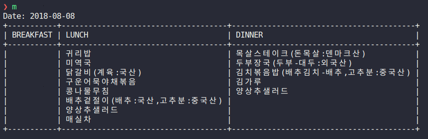

# KAIST Menu

A command line tool that prints today's menu of KAIST cafeterias.



In the screenshot, I've aliased `kaistmenu` with `m`.

# Installation

The package can be installed via `pip` as usual.

``` shellsession
$ pip install --user git+https://github.com/bitsandscraps/kaist-menu
```

# Usage

``` shellsession
kaistmenu
```

If the cache is corrupted for some reason, you can refresh it by
``` shellsession
kaistmenu -r
```
or
``` shellsession
kaistmenu --refresh
```

If a code is given as a positional argument, it prints the menu of the
corresponding cafeteria. Default is N6.
``` shellsession
kaistmenu north
```

## List of Available Codes

* 카이마루(북측 카페테리아): north
* 서맛골(서측 식당): west
* 동맛골(동측 학생식당): east
* 동맛골(동측 교직원식당): east2
* 교수회관: n6
* 문지캠퍼스 구내 식당: munji
* 화암 기숙사 식당: hwaam
